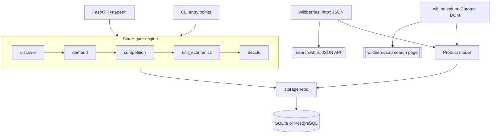

# Architecture

Three layers: collection, storage, and the stage-gate engine, with an HTTP API and a set of CLI entry points in front of them. Collection is the layer that constrains the rest of the design, for the reasons documented under data acquisition in [README.md](README.md).

## Collection

Both collectors implement the `MarketplaceCollector` interface in `core/collectors/base.py` and return the same normalized objects, so the engine never learns which one produced its input.

`wildberries.py` is an async httpx client for the public JSON search endpoint. It paces requests, retries on HTTP 429 with randomized exponential backoff, and routes through a proxy when `WB_PROXY_URL` is set. Price extraction handles both the current schema, where prices sit under `sizes[].price`, and the older top-level `priceU` and `salePriceU` fields, because the endpoint version changes without notice.

`wb_selenium.py` drives Chrome, loads the rendered search page, scrolls to trigger lazy loading, and parses product cards from the DOM. It exists because the JSON endpoints refuse requests from a rate-limited address while the page continues to serve results. Selectors match on stable class-name substrings, since Wildberries uses hashed CSS module names.

## Normalization

`core/models/product.py` defines a single marketplace-agnostic `Product`: external identifier, optional group identifier, title, brand, seller, current and pre-discount price in rubles, rating, review count, and URL. Adding a marketplace means writing a collector that produces this shape, not changing the engine.

## Storage

`core/storage/` holds the SQLAlchemy model, the engine factory, and a repository. Each crawl inserts a batch of `ProductObservation` rows that share one `collected_at` timestamp and carry the rank of the product in the result list.

Three operations serve the engine: write a snapshot, read the most recent snapshot for a query, and read review totals grouped by timestamp. The last of these produces the series that stage 2 uses to classify trend.

SQLite is the default so the project runs with no external services. Setting `DATABASE_URL` switches to PostgreSQL without other changes.

## Stage-gate engine

`core/engine/stages.py` defines the stage enumeration and `GateResult`, which carries the pass flag, a score, the list of reasons, and an evidence dictionary holding the metrics behind the decision. Every stage returns this shape.

Each stage module separates a pure analysis function from the gate that interprets it. `analyze_demand` computes metrics and `validate_demand` applies thresholds; `analyze_competition` and `evaluate_competition` follow the same split, as do `compute_unit_economics` and `evaluate_unit_economics`. The pure functions take plain lists of `Product` objects and no I/O, which is why the whole test suite runs offline.

`decide.py` runs stages 2 to 4 over one snapshot and reduces their gate results to a single verdict, a first-batch plan and a launch checklist.

## Explanation layer

`core/llm.py` turns a finished decision into a short plain-language summary. It builds a compact brief from the gate evidence and either sends it to Claude through the Anthropic SDK, when `LLM_API_KEY` is set, or renders a deterministic template when it is not. The model is instructed to explain only the supplied numbers, so the layer reads the gates' output and never computes a gate value. Any error falls back to the template, so the caller always receives a usable string.

## Interfaces

Every stage is reachable two ways. The CLI modules accept `--db` to read the stored snapshot, and the FastAPI routes in `core/api/stages.py` expose the same computation over HTTP. Stage 2 additionally supports a live path through the httpx collector. `core/main.py` also serves a single-page web interface at the root path, built on the pipeline endpoint, with the page itself in `core/web/`.

## Deployment

`docker-compose.yml` starts the API together with PostgreSQL and Redis. Local development needs neither: `pip install -e ".[dev]"` and SQLite are sufficient. Redis is provisioned for optional use alongside the collection scheduler.

## Planned components

A review feed to supply `analyze_reviews`, which already implements complaint extraction and is tested, but currently has no source of review text.

A separate `cloud/` package for the hosted service, holding pre-collected current and historical data. The open `core/` package remains independently runnable.
